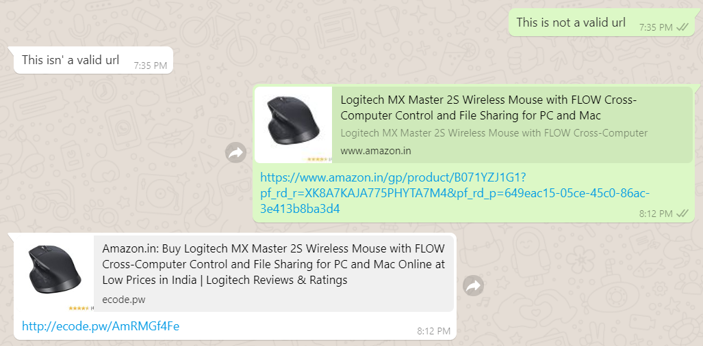

# ecode URL shortener

This is a personal URL shortener bot built using [Twilio API](https://github.com/twilio/twilio-node) in nodejs. The backend database used is postgreSQL.

## Screenshot

### Want one for yourself ?

1. Head over to [Twilio's website](https://www.twilio.com/console/sms/whatsapp/learn)
2. Create an account and login if you haven't and configure your number with the [Twilio whatsapp sandbox](https://www.twilio.com/console/sms/whatsapp/sandbox)
3. Follow the instructions you find on the website
4. Now head over to [Heroku](https://dashboard.heroku.com/) to deploy the bot. Sign up if you haven't already and login
5. Create an application and add heroku-postgres as a resource
6. Alright now your database and heroku is all set up and ready
7. Deploying the bot
    - Clone this repository
    - Create a .env file containing the following information. (Ignore the #Required and #Optional lines)

            #Required ~ Important
            ACCOUNT_SID=<The SID that you can get from Twilio dashboard>
            AUTH_TOKEN=<The SID that you can get from Twilio dashboard>
            DOMAIN=<Put your custom domain link here or just put the herokuapp link>
            
            #Optional ~ meh
            PORT=<Custom PORT number> [Not necessarily required]

    - Push code to heroku using heroku cli or deploy the app by connecting the Github repo to Heroku.
9. Test by sending a link to the bot